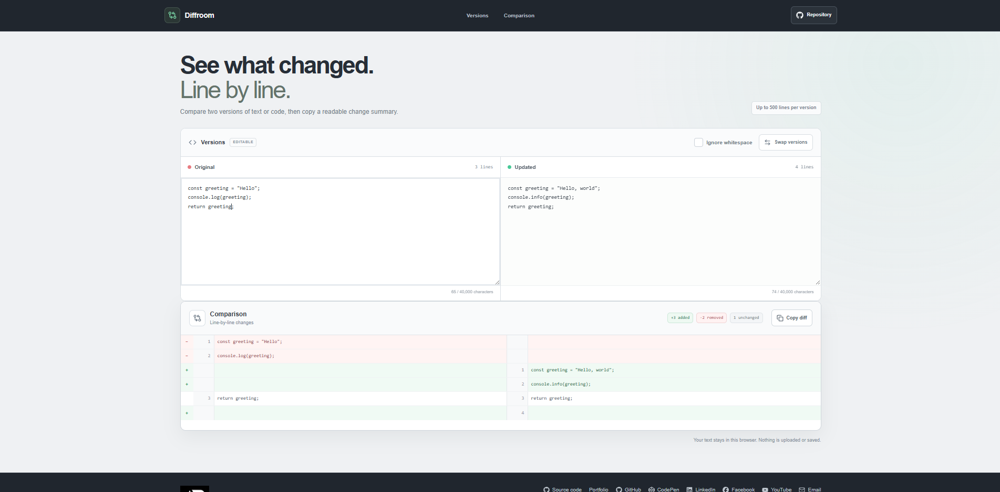

# Code Diff Viewer

Diffroom compares two versions of text or code and shows which lines were added, removed, or left unchanged. It is intended for developers and writers who want to review a small change without opening a full source control client.

**Live site:** [https://a2rp.github.io/code-diff-viewer/](https://a2rp.github.io/code-diff-viewer/)

## What is included

- Editable **Original** and **Updated** text panels with character and line counts.
- A line-by-line comparison that pairs shared context and marks added and removed lines.
- Change totals for added, removed, and unchanged lines.
- An **Ignore whitespace** option for comparing lines after whitespace is removed. Letter case remains significant.
- **Swap versions** to reverse the comparison.
- **Copy diff** to copy a readable text summary with `+`, `-`, and context prefixes.
- A responsive fixed header with page navigation, a public source link, shared profile/support footer, and a **Back to top** control after scrolling.

## How the comparison works

Paste or type the earlier version on the left and the later version on the right. The comparison updates as either panel changes. Green lines were added to the updated version, red lines were removed, and plain rows are shared lines. A final newline is treated as a line ending, not as an extra blank line; blank lines within the text remain part of the comparison. Enable **Ignore whitespace** when indentation or spacing changes should not count as a line change. Use **Copy diff** to place the visible comparison in the clipboard.

The line-based comparison uses a longest common subsequence pass. Each version is limited to 40,000 characters and 500 lines so large inputs remain bounded. The tool compares lines only. It does not produce a Git patch with file metadata, syntax highlighting, or word-level character changes.

## Privacy and storage

The comparison runs in the current browser page. Text is not uploaded to a server or saved to local storage. Refreshing the page restores the example. Clipboard access requires a supported browser context, such as the deployed HTTPS site.

## Run locally

Use Node.js and npm, then run these commands from this directory:

```sh
npm install
npm run dev
```

## Checks and deployment

```sh
npm run lint
npm test
npm run build
npm run deploy
```

The tests cover line additions and removals, shared context, whitespace comparison, patch formatting, and input limits. The deploy command builds the app and publishes `dist` to the `gh-pages` branch. Vite uses `/code-diff-viewer/` as its GitHub Pages base path.

## Future improvements

These are ideas and are not implemented yet:

- Add word-level and character-level highlighting within changed lines.
- Add language-aware syntax coloring and foldable context.
- Import files or compare pasted unified patches.
- Add configurable context line counts and split/unified view modes.

## Links

- Portfolio: [https://www.ashishranjan.net](https://www.ashishranjan.net)
- GitHub: [https://github.com/a2rp](https://github.com/a2rp)
- CodePen: [https://codepen.io/ash1198](https://codepen.io/ash1198)
- LinkedIn: [https://www.linkedin.com/in/aashishranjan](https://www.linkedin.com/in/aashishranjan)
- Facebook: [https://www.facebook.com/theash.ashish/](https://www.facebook.com/theash.ashish/)
- YouTube: [https://www.youtube.com/@ashishranjan-ashz?sub_confirmation=1](https://www.youtube.com/@ashishranjan-ashz?sub_confirmation=1)
- Email: [mailto:ash.ranjan09@gmail.com](mailto:ash.ranjan09@gmail.com)

## Support

- Support: [https://a2rp-donation-page.netlify.app/](https://a2rp-donation-page.netlify.app/)
- Buy Me a Coffee: [https://buymeacoffee.com/ashishranjan](https://buymeacoffee.com/ashishranjan)
- Patreon: [https://www.patreon.com/ashishranjan](https://www.patreon.com/ashishranjan)
